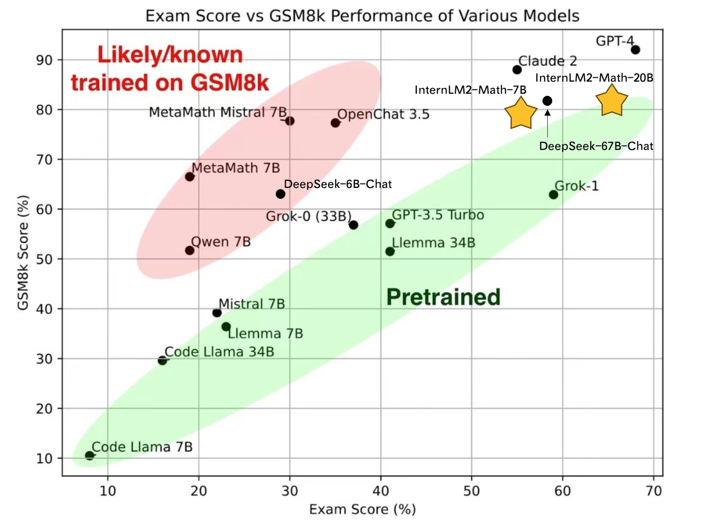

# InternLM-Math

<div align="center">


  <div> </div>
  <div align="center">
    <b><font size="5">InternLM-Math</font></b>
    <sup>
      <a href="https://internlm.intern-ai.org.cn/">
        <i><font size="4">HOT</font></i>
      </a>
    </sup>
    <div> </div>
  </div>

State-of-the-art bilingual open-sourced Math reasoning LLMs. 
A **solver**, **prover**, **verifier**, **augmentor**.
</div>

# Introduction
- **7B and 20B Chinese and English Math LMs with better than ChatGPT performances.** InternLM2-Math are continued pretrained from InternLM2-Base with ~100B high quality math-related tokens and SFT with ~2M bilingual math supervised data. We apply minhash and exact number match to decontaminate possible test set leakage. 
- **Add Lean as a support language for math problem solving and math theorem proving.** We are exploring combining Lean 3 with InternLM-Math for verifiable math reasoning. InternLM-Math can generate Lean codes for simple math reasoning tasks like GSM8K or provide possible proof tactics based on Lean states.
- **Also can be viewed as a reward model, which supports the Outcome/Process/Lean Reward Model.** We supervise InternLM2-Math with various types of reward modeling data, to make InternLM2-Math can also verify chain-of-thought processes. We also add the ability to convert a chain-of-thought process into Lean 3 code.
- **A Math LM Augment Helper** and **Code Intepreter**. InternLM2-Math can help augment math reasoning problems and solve them using the code interpreter which makes you generate synthesis data quicker!



# Models
**InternLM2-Math-Base-7B** and **InternLM2-Math-Base-20B** are pretrained checkpoints. **InternLM2-Math-7B** and **InternLM2-Math-20B** are SFT checkpoints.
| Model |Model Type           | Transformers(HF) |Release Date |
|---|---|---|---|
| **InternLM2-Math-Base-7B**    | Base| [🤗internlm/internlm2-math-base-7b](https://huggingface.co/internlm/internlm2-math-base-7b) | 2024-01-23|
| **InternLM2-Math-Base-20B**    | Base| [🤗internlm/internlm2-math-base-20b](https://huggingface.co/internlm/internlm2-math-base-20b) | 2024-01-23|
| **InternLM2-Math-7B**    | Chat| [🤗internlm/internlm2-math-7b](https://huggingface.co/internlm/internlm2-math-7b) | 2024-01-23|
| **InternLM2-Math-20B**    | Chat| [🤗internlm/internlm2-math-20b](https://huggingface.co/internlm/internlm2-math-20b) | 2024-01-23|


# Performance

## Pretrain Performance
We evaluate pretrain checkpoints based on greedy decoding with few-shot COT. Details of pretraining will be introduced in the tech report.
| Model                  |  GSM8K  | MATH   |
|------------------------|---------|--------|
| Llama2-7B |  11.8 | 3.2 |
| Llemma-7B |  36.4 | 18.0 |
| InternLM2-Base-7B |  36.5 | 8.6 |
| **InternLM2-Math-Base-7B** |  **49.2** | **21.5** |
| Minerva-8B |  16.2 | 14.1 |
| InternLM2-Base-20B |  54.6 | 13.7 |
| **InternLM2-Math-Base-20B** |  **63.7** | **27.3** |
| Llemma-34B |  51.5 | 25.0 |
| Minerva-62B |  52.4 | 27.6 |
| Minerva-540B |  58.8 | 33.6 |


## SFT Peformance
All performance is based on greedy decoding with COT. We notice that the performance of Hungary has a big variance between our different checkpoints, while other performance is very stable. This may be due to the problem amount about Hungary. 
| Model                  | Model Type           | GSM8K  | MATH   | Hungary | 
|------------------------|----------------------|--------|--------|---------|
| Qwen-7B-Chat           | Genearl              | 51.7   | 11.6   | -       |
| DeepSeek-7B-Chat       | General              | 63.0   | 15.8   | 28.5    | 
| InternLM2-Chat-7B      | General              | 70.7   | 23.0   | -       |
| ChatGLM3-6B            | General              | 53.8   | 20.4   | 32      |
| MetaMath-Mistral-7B    | Mathematics          | 77.7   | 28.2   | 29      |
| MetaMath-Llemma-7B     | Mathematics          | 69.2   | 30.0   | -       |
| **InternLM2-Math-7B**      | Mathematics          | **78.1**   | **34.6**   | **55**      |
| InternLM2-Chat-20B     | General              | 79.6   | 31.9   | -       | 
| MetaMath-Llemma-34B    | Mathematics          | 75.8   | 34.8   | -       | 
| **InternLM2-Math-20B**     | Mathematics          | **82.6**   | **37.7**   | **66**      | 
| Qwen-72B               | General              | 78.9   | 35.2   | 52      | 
| DeepSeek-67B           | General              | 84.1   | 32.6   | 58      | 
| ChatGPT (GPT-3.5)      | General              | 80.8   | 34.1   | 41      |
| GPT4 (First version)   | General              | 92.0   | 42.5   | 68      | 

# Inference

## LMDeploy
We suggest using [LMDeploy](https://github.com/InternLM/LMDeploy)(>=0.2.1) for inference.
```python
from lmdeploy import pipeline, TurbomindEngineConfig, ChatTemplateConfig

backend_config = TurbomindEngineConfig(model_name='internlm2-chat-7b', tp=1, cache_max_entry_count=0.3)
chat_template = ChatTemplateConfig(model_name='internlm2-chat-7b', system='', eosys='', meta_instruction='')
pipe = pipeline(model_path='internlm/internlm2-math-7b', chat_template_config=chat_template, backend_config=backend_config)

problem = '1+1='
result = pipe([problem], request_output_len=1024, top_k=1)
```

## Huggingface
```python
import torch
from transformers import AutoTokenizer, AutoModelForCausalLM
tokenizer = AutoTokenizer.from_pretrained("internlm/internlm2-math-7b", trust_remote_code=True)
# Set `torch_dtype=torch.float16` to load model in float16, otherwise it will be loaded as float32 and might cause OOM Error.
model = AutoModelForCausalLM.from_pretrained("internlm/internlm2-math-7b", trust_remote_code=True, torch_dtype=torch.float16).cuda()
model = model.eval()
response, history = model.chat(tokenizer, "1+1=", history=[], meta_instruction="")
print(response)
```

# Special usages
We list some instructions used in our SFT. You can use them to help you. You can use the other ways to prompt the model, but the following are recommended. InternLM2-Math may combine the following abilities but it is not guaranteed.

| Description | Query |
| --- | --- |
| Solving question via chain-of-thought | {Question} |
| Solving question via Lean 3 | {Question}\nSolve this via Lean 3 |
| Outcome reward model | Given a question and an answer, check is it correct?\nQuestion:{Question}\nAnswer:{COT} |
| Process reward model | Given a question and an answer, check correctness of each step.\nQuestion:{Question}\nAnswer:{COT} |
| Reward model | Given a question and two answers, which one is better? \nQuestion:{Question}\nAnswer 1:{COT}\nAnswer 2:{COT} |
| Convert chain-of-thought to Lean 3 | Convert this answer into Lean3. Question:{Question}\nAnswer:{COT} |
| Convert Lean 3 to chain-of-thought | Convert this lean 3 code into a natural language problem with answers:\n{LEAN Code} |
| Translate question and chain-of-thought answer to a proof statement | Convert this question and answer into a proof format.\nQuestion:{Question}\nAnswer:{COT} |
| Translate proof problem to Lean 3 | Convert this natural langauge statement into a Lean 3 theorem statement:{Theorem} |
| Translate Lean 3 to proof problem | Convert this Lean 3 theorem statement into natural language:{STATEMENT} |
| Suggest a tactic based on Lean state | Given the Lean 3 tactic state, suggest a next tactic:\n{LEAN State} |
| Rephrase Problem | Describe this problem in another way. {Question} |
| Augment Problem | Please augment a new problem based on: {Question} |
| Augment a harder Problem | Increase the complexity of the problem: {Question} |
| Change specific numbers | Change specific numbers: {Question}|
| Introduce fractions or percentages | Introduce fractions or percentages: {Question}|
| Code Intepreter | [lagent](https://github.com/InternLM/InternLM/blob/main/agent/lagent.md) |
| In-context Learning | Question:{Question}\nAnswer:{COT}\n...Question:{Question}\nAnswer:{COT}|

# Fine-tune and others
Please refer to [InternLM](https://github.com/InternLM/InternLM/tree/main).

# Known issues
Our model is still under development and will be upgraded. There are some possible issues of InternLM-Math. If you find performances of some abilities are not great, welcome to open an issue.
- Jump the calculating step.
- Perform badly at Chinese fill-in-the-bank problems and English choice problems due to SFT data composition.
- Tend to generate Code Interpreter when facing Chinese problems due to SFT data composition.
- The reward model mode can be better leveraged with assigned token probabilities.
- Code switch due to SFT data composition.
- Some abilities of Lean can only be adapted to GSM8K-like problems (e.g. Convert chain-of-thought to Lean 3), and performance related to Lean is not guaranteed.

# Citation and Tech Report
To be appended.
