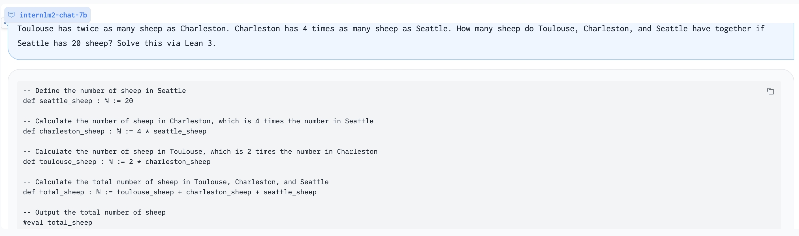

# InternLM-Math

<div align="center">


  <div> </div>
  <div align="center">
    <b><font size="5">InternLM-Math</font></b>
    <sup>
      <a href="https://internlm.intern-ai.org.cn/">
        <i><font size="4">HOT</font></i>
      </a>
    </sup>
    <div> </div>
  </div>

[](./LICENSE)

State-of-the-art bilingual open-sourced Math reasoning LLMs. 
A **solver**, **prover**, **verifier**, **augmentor**.


[📑 Paper](https://arxiv.org/abs/2402.06332) [💻 Github](https://github.com/InternLM/InternLM-Math) [🤗 Demo](https://huggingface.co/spaces/internlm/internlm2-math-7b) [🤗 Checkpoints](https://huggingface.co/collections/internlm/internlm2-math-65b0ce88bf7d3327d0a5ad9f) [](https://openxlab.org.cn/models/detail/OpenLMLab/InternLM2-Math-7B) [ ModelScope](https://modelscope.cn/models/Shanghai_AI_Laboratory/internlm2-math-7b/summary)
</div>

# News
- [2024.10.22] We release **InternLM2.5-Step-Prover** policy and critic models with 14k proves found in Lean-Workbook. [🤗Dataset](https://huggingface.co/datasets/internlm/Lean-Workbook) [🤗Policy-model](https://huggingface.co/internlm/internlm2_5-step-prover) [🤗Critic-model](https://huggingface.co/internlm/internlm2_5-step-prover-critic) [📑 Paper](https://arxiv.org/abs/2410.15700)
- [2024.07.25] We release **Lean-Github** and **InternLM2-Step-Prover** with 29K theorems compiled from 100+ Lean 4 repos and a 7B models fine-tuned on Lean-Github and Lean-Workbook with SOTA performance on MiniF2F-test (54.5%), ProofNet (18.1%), and Putnam (5 problems). [🤗Dataset](https://huggingface.co/datasets/internlm/Lean-Github) [🤗Model](https://huggingface.co/internlm/internlm2-step-prover) [📑 Paper](https://arxiv.org/abs/2407.17227) [📖 README](https://github.com/InternLM/InternLM-Math/blob/main/lean-github/README.md)
- [2024.06.06] We release **Lean-Workbook** with 57K math problems formalized in Lean 4 with 5K searched proof for autoformalization and auto theorem proving. [🤗Dataset](https://huggingface.co/datasets/internlm/Lean-Workbook) [📑 Paper](https://arxiv.org/abs/2406.03847)
- [2024.05.24] We release updated version **InternLM2-Math-Plus** with 4 sizes and state-of-the-art performances including 1.8B, 7B, 20B, and 8x22B. We improve informal math reasoning performance (chain-of-thought and code-interpreter) and formal math reasoning performance (LEAN 4 translation and LEAN 4 theorem proving) significantly.
- [2024.02.10] We add tech reports and citation references.
- [2024.01.31] We add MiniF2F results with evaluation codes!
- [2024.01.29] We add checkpoints from ModelScope. Update results about majority voting and Code Interpreter. Tech report is on the way!
- [2024.01.26] We add checkpoints from OpenXLab, which ease Chinese users to download!

# InternLM2-Math-Plus

## Checkpoints

| Model                                | Model Type | Transformers(HF)                                                                                                | ModelScope                                                                                                                                              | Release Date |
| ------------------------------------ | ---------- | --------------------------------------------------------------------------------------------------------------- | ------------------------------------------------------------------------------------------------------------------------------------------------------- | ------------ |
| **InternLM2-Math-Plus-1.8B**         | Chat       | 🤗[internlm/internlm2-math-plus-1_8b](https://huggingface.co/internlm/internlm2-math-plus-1_8b/)                 | [Shanghai_AI_Laboratory/internlm2-math-plus-1_8b](https://modelscope.cn/models/Shanghai_AI_Laboratory/internlm2-math-plus-1_8b/summary)                 | 2024-05-27   |
| **InternLM2-Math-Plus-7B**           | Chat       | 🤗[internlm/internlm2-math-plus-7b](https://huggingface.co/internlm/internlm2-math-plus-7b/)                     | [Shanghai_AI_Laboratory/internlm2-math-plus-7b](https://modelscope.cn/models/Shanghai_AI_Laboratory/internlm2-math-plus-7b/summary)                     | 2024-05-27   |
| **InternLM2-Math-Plus-20B**          | Chat       | 🤗[internlm/internlm2-math-plus-20b](https://huggingface.co/internlm/internlm2-math-plus-20b/)                   | [Shanghai_AI_Laboratory/internlm2-math-plus-20b](https://modelscope.cn/models/Shanghai_AI_Laboratory/internlm2-math-plus-20b/summary)                   | 2024-05-27   |
| **InternLM2-Math-Plus-Mixtral8x22B** | Chat       | 🤗[internlm/internlm2-math-plus-mixtral8x22b](https://huggingface.co/internlm/internlm2-math-plus-mixtral8x22b/) | [Shanghai_AI_Laboratory/internlm2-math-plus-mixtral8x22b](https://modelscope.cn/models/Shanghai_AI_Laboratory/internlm2-math-plus-mixtral8x22b/summary) | 2024-05-27   |

## Formal Math Reasoning
We evaluate the performance of InternLM2-Math-Plus on formal math reasoning benchmark MiniF2F-test. The evaluation setting is same as Llemma with LEAN 4. 

> This is how to reproduce our performance on [MiniF2F](minif2f/README.md).

| Models                           | MiniF2F-test |
| -------------------------------- | ------------ |
| ReProver                         | 26.5         |
| LLMStep                          | 27.9         |
| GPT-F                            | 36.6         |
| HTPS                             | 41.0         |
| Llemma-7B                        | 26.2         |
| Llemma-34B                       | 25.8         |
| InternLM2-Math-7B-Base           | 30.3         |
| InternLM2-Math-20B-Base          | 29.5         |
| InternLM2-Math-Plus-1.8B         | 38.9         |
| InternLM2-Math-Plus-7B           | **43.4**     |
| InternLM2-Math-Plus-20B          | 42.6         |
| InternLM2-Math-Plus-Mixtral8x22B | 37.3         |

## Informal Math Reasoning
We evaluate the performance of InternLM2-Math-Plus on informal math reasoning benchmark MATH and GSM8K. InternLM2-Math-Plus-1.8B outperforms MiniCPM-2B in the smallest size setting. InternLM2-Math-Plus-7B outperforms Deepseek-Math-7B-RL which is the state-of-the-art math reasoning open source model. InternLM2-Math-Plus-Mixtral8x22B achieves 68.5 on MATH (with Python) and 91.8 on GSM8K.

> For tool-calling inference and evaluation, please see the [agent section](agent/).

| Model                            | MATH     | MATH-Python | GSM8K    |
| -------------------------------- | -------- | ----------- | -------- |
| MiniCPM-2B                       | 10.2     | -           | 53.8     |
| InternLM2-Math-Plus-1.8B         | **37.0** | **41.5**    | **58.8** |
| InternLM2-Math-7B                | 34.6     | 50.9        | 78.1     |
| Deepseek-Math-7B-RL              | 51.7     | 58.8        | **88.2** |
| InternLM2-Math-Plus-7B           | **53.0** | **59.7**    | 85.8     |
| InternLM2-Math-20B               | 37.7     | 54.3        | 82.6     |
| InternLM2-Math-Plus-20B          | **53.8** | **61.8**    | **87.7** |
| Mixtral8x22B-Instruct-v0.1       | 41.8     | -           | 78.6     |
| Eurux-8x22B-NCA                  | 49.0     | -           | -        |
| InternLM2-Math-Plus-Mixtral8x22B | **58.1** | **68.5**    | **91.8** |

We also evaluate models on [MathBench-A](https://github.com/open-compass/MathBench). InternLM2-Math-Plus-Mixtral8x22B has comparable performance compared to Claude 3 Opus.
| Model                            | Arithmetic | Primary | Middle | High | College | Average |
| -------------------------------- | ---------- | ------- | ------ | ---- | ------- | ------- |
| GPT-4o-0513                      | 77.7       | 87.7    | 76.3   | 59.0 | 54.0    | 70.9    |
| Claude 3 Opus                    | 85.7       | 85.0    | 58.0   | 42.7 | 43.7    | 63.0    |
| Qwen-Max-0428                    | 72.3       | 86.3    | 65.0   | 45.0 | 27.3    | 59.2    |
| Qwen-1.5-110B                    | 70.3       | 82.3    | 64.0   | 47.3 | 28.0    | 58.4    |
| Deepseek-V2                      | 82.7       | 89.3    | 59.0   | 39.3 | 29.3    | 59.9    |
| Llama-3-70B-Instruct             | 70.3       | 86.0    | 53.0   | 38.7 | 34.7    | 56.5    |
| InternLM2-Math-Plus-Mixtral8x22B | 77.5       | 82.0    | 63.6   | 50.3 | 36.8    | 62.0    |
| InternLM2-Math-20B               | 58.7       | 70.0    | 43.7   | 24.7 | 12.7    | 42.0    |
| InternLM2-Math-Plus-20B          | 65.8       | 79.7    | 59.5   | 47.6 | 24.8    | 55.5    |
| Llama3-8B-Instruct               | 54.7       | 71.0    | 25.0   | 19.0 | 14.0    | 36.7    |
| InternLM2-Math-7B                | 53.7       | 67.0    | 41.3   | 18.3 | 8.0     | 37.7    |
| Deepseek-Math-7B-RL              | 68.0       | 83.3    | 44.3   | 33.0 | 23.0    | 50.3    |
| InternLM2-Math-Plus-7B           | 61.4       | 78.3    | 52.5   | 40.5 | 21.7    | 50.9    |
| MiniCPM-2B                       | 49.3       | 51.7    | 18.0   | 8.7  | 3.7     | 26.3    |
| InternLM2-Math-Plus-1.8B         | 43.0       | 43.3    | 25.4   | 18.9 | 4.7     | 27.1    |


# Introduction (For InternLM2-Math)
- **7B and 20B Chinese and English Math LMs with better than ChatGPT performances.** InternLM2-Math are continued pretrained from InternLM2-Base with ~100B high quality math-related tokens and SFT with ~2M bilingual math supervised data. We apply minhash and exact number match to decontaminate possible test set leakage. 
- **Add Lean as a support language for math problem solving and math theorem proving.** We are exploring combining Lean 3 with InternLM-Math for verifiable math reasoning. InternLM-Math can generate Lean codes for simple math reasoning tasks like GSM8K or provide possible proof tactics based on Lean states.
- **Also can be viewed as a reward model, which supports the Outcome/Process/Lean Reward Model.** We supervise InternLM2-Math with various types of reward modeling data, to make InternLM2-Math can also verify chain-of-thought processes. We also add the ability to convert a chain-of-thought process into Lean 3 code.
- **A Math LM Augment Helper** and **Code Interpreter**. InternLM2-Math can help augment math reasoning problems and solve them using the code interpreter which makes you generate synthesis data quicker!


# Models
**InternLM2-Math-Base-7B** and **InternLM2-Math-Base-20B** are pretrained checkpoints. **InternLM2-Math-7B** and **InternLM2-Math-20B** are SFT checkpoints.
| Model                       | Model Type | Transformers(HF)                                                                             | OpenXLab                                                                                                                                                      | ModelScope                                                                                                                                                             | Release Date |
| --------------------------- | ---------- | -------------------------------------------------------------------------------------------- | ------------------------------------------------------------------------------------------------------------------------------------------------------------- | ---------------------------------------------------------------------------------------------------------------------------------------------------------------------- | ------------ |
| **InternLM2-Math-Base-7B**  | Base       | [🤗internlm/internlm2-math-base-7b](https://huggingface.co/internlm/internlm2-math-base-7b)   | [](https://openxlab.org.cn/models/detail/OpenLMLab/InternLM2-Math-Base-7B)  | [ internlm2-math-base-7b](https://modelscope.cn/models/Shanghai_AI_Laboratory/internlm2-math-base-7b/summary)   | 2024-01-23   |
| **InternLM2-Math-Base-20B** | Base       | [🤗internlm/internlm2-math-base-20b](https://huggingface.co/internlm/internlm2-math-base-20b) | [](https://openxlab.org.cn/models/detail/OpenLMLab/InternLM2-Math-Base-20B) | [ internlm2-math-base-20b](https://modelscope.cn/models/Shanghai_AI_Laboratory/internlm2-math-base-20b/summary) | 2024-01-23   |
| **InternLM2-Math-7B**       | Chat       | [🤗internlm/internlm2-math-7b](https://huggingface.co/internlm/internlm2-math-7b)             | [](https://openxlab.org.cn/models/detail/OpenLMLab/InternLM2-Math-7B)       | [ internlm2-math-7b](https://modelscope.cn/models/Shanghai_AI_Laboratory/internlm2-math-7b/summary)             | 2024-01-23   |
| **InternLM2-Math-20B**      | Chat       | [🤗internlm/internlm2-math-20b](https://huggingface.co/internlm/internlm2-math-20b)           | [](https://openxlab.org.cn/models/detail/OpenLMLab/InternLM2-Math-20B)      | [ internlm2-math-20b](https://modelscope.cn/models/Shanghai_AI_Laboratory/internlm2-math-20b/summary)           | 2024-01-23   |


# Performance

## Pretrain Performance
We evaluate pretrain checkpoints based on greedy decoding with few-shot COT. Details of pretraining will be introduced in the tech report.
| Benchmark                   | GSM8K MAJ@1 | GSM8K MAJ@100 | MATH MAJ@1 | MATH MAJ@256 |
| --------------------------- | ----------- | ------------- | ---------- | ------------ |
| Llama2-7B                   | 14.6        | -             | 2.5        | -            |
| Llemma-7B                   | 36.4        | 54.0          | 18.0       | 33.5         |
| InternLM2-Base-7B           | 36.5        | -             | 8.6        | -            |
| **InternLM2-Math-Base-7B**  | **49.2**    | **75.7**      | **21.5**   | **35.6**     |
| Minerva-8B                  | 16.2        | 28.4          | 14.1       | 25.4         |
| InternLM2-Base-20B          | 54.6        | -             | 13.7       | -            |
| **InternLM2-Math-Base-20B** | **63.7**    | **84.8**      | **27.3**   | **46.2**     |
| Llemma-34B                  | 51.5        | 69.3          | 25.0       | 43.1         |
| Minerva-62B                 | 52.4        | 68.5          | 27.6       | 43.4         |
| Minerva-540B                | 58.8        | 78.5          | 33.6       | 50.3         |

We evaluate pretrain checkpoints using few-shot on MiniF2F. Please see **eval/pretrain/minif2f** for evaluation.
| Benchmark                   | MiniF2F-test |
| --------------------------- | ------------ |
| ReProver                    | 26.5         |
| LLMStep                     | 27.9         |
| Code-Llama-7B               | 26.2         |
| Code-Llama-34B              | 25.8         |
| Llemma-7B                   | 26.2         |
| Llemma-34B                  | 25.8         |
| **InternLM2-Math-7B-Base**  | 30.3         |
| **InternLM2-Math-20B-Base** | 29.5         |


## SFT Peformance
All performance is based on greedy decoding with COT. We notice that the performance of Hungary has a big variance between our different checkpoints, while other performance is very stable. This may be due to the problem amount about Hungary. 
| Model                  | Model Type  | GSM8K    | MATH     | Hungary |
| ---------------------- | ----------- | -------- | -------- | ------- |
| Qwen-7B-Chat           | Genearl     | 51.7     | 11.6     | -       |
| DeepSeek-7B-Chat       | General     | 63.0     | 15.8     | 28.5    |
| InternLM2-Chat-7B      | General     | 70.7     | 23.0     | -       |
| ChatGLM3-6B            | General     | 53.8     | 20.4     | 32      |
| MetaMath-Mistral-7B    | Mathematics | 77.7     | 28.2     | 29      |
| MetaMath-Llemma-7B     | Mathematics | 69.2     | 30.0     | -       |
| **InternLM2-Math-7B**  | Mathematics | **78.1** | **34.6** | **55**  |
| InternLM2-Chat-20B     | General     | 79.6     | 31.9     | -       |
| MetaMath-Llemma-34B    | Mathematics | 75.8     | 34.8     | -       |
| **InternLM2-Math-20B** | Mathematics | **82.6** | **37.7** | **66**  |
| Qwen-72B               | General     | 78.9     | 35.2     | 52      |
| DeepSeek-67B           | General     | 84.1     | 32.6     | 58      |
| ChatGPT (GPT-3.5)      | General     | 80.8     | 34.1     | 41      |
| GPT4 (First version)   | General     | 92.0     | 42.5     | 68      |

## Code Intepreter Performance
All performance is based on interacting with Python.
| Model                          | GSM8K    | MATH     |
| ------------------------------ | -------- | -------- |
| DeepSeek-Coder-Instruct-7B     | 62.8     | 28.6     |
| DeepSeek-Coder-Instruct-1.5-7B | 72.6     | 34.1     |
| ToRA-7B                        | 72.6     | 44.6     |
| MathCODER-CL-7B                | 67.8     | 30.2     |
| InternLM2-Chat-7B              | 77.9     | 45.1     |
| **InternLM2-Math-7B**          | **79.4** | **50.9** |
| ToRA-13B                       | 75.8     | 48.1     |
| MathCODER-CL-13B               | 74.1     | 35.9     |
| InternLM2-Chat-20B             | **84.5** | 51.2     |
| **InternLM2-Math-20B**         | 80.7     | **54.3** |
| MathCODER-CL-34B               | 81.7     | 45.2     |
| ToRA-70B                       | 84.3     | 49.7     |
| GPT-4 Code Interpreter *       | **97.0** | **69.7** |

# Eval
You can effortlessly evaluate InternLM2-Math across a diverse array of mathematical datasets, such as Math and GSM8K, using [OpenCompass](https://github.com/open-compass/opencompass) with a single command. To get started, simply execute the following in your terminal after installing OpenCompass:

```bash
python run.py --models hf_internlm2_chat_math_7b --datasets gsm8k_gen math_gen_736506
```

Alternatively, for a streamlined experience, you can utilize a predefined configuration file. To do this, run the command below, making sure to adjust the arguments according to your requirements:

```bash
python run.py config/eval_internlm_math_chat.py
```

# Inference

## LMDeploy
We suggest using [LMDeploy](https://github.com/InternLM/LMDeploy)(>=0.2.1) for inference.
```python
from lmdeploy import pipeline, TurbomindEngineConfig, ChatTemplateConfig

backend_config = TurbomindEngineConfig(model_name='internlm2-chat-7b', tp=1, cache_max_entry_count=0.3)
chat_template = ChatTemplateConfig(model_name='internlm2-chat-7b', system='', eosys='', meta_instruction='')
pipe = pipeline(model_path='internlm/internlm2-math-7b', chat_template_config=chat_template, backend_config=backend_config)

problem = '1+1='
result = pipe([problem], request_output_len=1024, top_k=1)
```

## Huggingface
```python
import torch
from transformers import AutoTokenizer, AutoModelForCausalLM
tokenizer = AutoTokenizer.from_pretrained("internlm/internlm2-math-7b", trust_remote_code=True)
# Set `torch_dtype=torch.float16` to load model in float16, otherwise it will be loaded as float32 and might cause OOM Error.
model = AutoModelForCausalLM.from_pretrained("internlm/internlm2-math-7b", trust_remote_code=True, torch_dtype=torch.float16).cuda()
model = model.eval()
response, history = model.chat(tokenizer, "1+1=", history=[], meta_instruction="")
print(response)
```

# Special usages
We list some instructions used in our SFT. You can use them to help you. You can use the other ways to prompt the model, but the following are recommended. InternLM2-Math may combine the following abilities but it is not guaranteed.

Translate proof problem to Lean:


Using Lean 3 to solve GSM8K problem:


Generate problem based on Lean 3 code:


Play 24 point game:


Augment a harder math problem:


| Description                                                         | Query                                                                                                        |
| ------------------------------------------------------------------- | ------------------------------------------------------------------------------------------------------------ |
| Solving question via chain-of-thought                               | {Question}                                                                                                   |
| Solving question via Lean 3                                         | {Question}\nSolve this via Lean 3                                                                            |
| Outcome reward model                                                | Given a question and an answer, check is it correct?\nQuestion:{Question}\nAnswer:{COT}                      |
| Process reward model                                                | Given a question and an answer, check correctness of each step.\nQuestion:{Question}\nAnswer:{COT}           |
| Reward model                                                        | Given a question and two answers, which one is better? \nQuestion:{Question}\nAnswer 1:{COT}\nAnswer 2:{COT} |
| Convert chain-of-thought to Lean 3                                  | Convert this answer into Lean3. Question:{Question}\nAnswer:{COT}                                            |
| Convert Lean 3 to chain-of-thought                                  | Convert this lean 3 code into a natural language problem with answers:\n{LEAN Code}                          |
| Translate question and chain-of-thought answer to a proof statement | Convert this question and answer into a proof format.\nQuestion:{Question}\nAnswer:{COT}                     |
| Translate proof problem to Lean 3                                   | Convert this natural langauge statement into a Lean 3 theorem statement:{Theorem}                            |
| Translate Lean 3 to proof problem                                   | Convert this Lean 3 theorem statement into natural language:{STATEMENT}                                      |
| Suggest a tactic based on Lean state                                | Given the Lean 3 tactic state, suggest a next tactic:\n{LEAN State}                                          |
| Rephrase Problem                                                    | Describe this problem in another way. {Question}                                                             |
| Augment Problem                                                     | Please augment a new problem based on: {Question}                                                            |
| Augment a harder Problem                                            | Increase the complexity of the problem: {Question}                                                           |
| Change specific numbers                                             | Change specific numbers: {Question}                                                                          |
| Introduce fractions or percentages                                  | Introduce fractions or percentages: {Question}                                                               |
| Code Interpreter                                                    | [lagent](https://github.com/InternLM/InternLM/blob/main/agent/lagent.md)                                     |
| In-context Learning                                                 | Question:{Question}\nAnswer:{COT}\n...Question:{Question}\nAnswer:{COT}                                      |

# Fine-tune and others
Please refer to [InternLM](https://github.com/InternLM/InternLM/tree/main).

# Known issues
Our model is still under development and will be upgraded. There are some possible issues of InternLM-Math. If you find performances of some abilities are not great, welcome to open an issue.
- Jump the calculating step.
- Perform badly at Chinese fill-in-the-bank problems and English choice problems due to SFT data composition.
- Tend to generate Code Interpreter when facing Chinese problems due to SFT data composition.
- The reward model mode can be better leveraged with assigned token probabilities.
- Code switch due to SFT data composition.
- Some abilities of Lean can only be adapted to GSM8K-like problems (e.g. Convert chain-of-thought to Lean 3), and performance related to Lean is not guaranteed.

# Citation and Tech Report
```
@misc{ying2024internlmmath,
      title={InternLM-Math: Open Math Large Language Models Toward Verifiable Reasoning}, 
      author={Huaiyuan Ying and Shuo Zhang and Linyang Li and Zhejian Zhou and Yunfan Shao and Zhaoye Fei and Yichuan Ma and Jiawei Hong and Kuikun Liu and Ziyi Wang and Yudong Wang and Zijian Wu and Shuaibin Li and Fengzhe Zhou and Hongwei Liu and Songyang Zhang and Wenwei Zhang and Hang Yan and Xipeng Qiu and Jiayu Wang and Kai Chen and Dahua Lin},
      year={2024},
      eprint={2402.06332},
      archivePrefix={arXiv},
      primaryClass={cs.CL}
}
@misc{ying2024lean,
      title={Lean Workbook: A large-scale Lean problem set formalized from natural language math problems}, 
      author={Huaiyuan Ying and Zijian Wu and Yihan Geng and Jiayu Wang and Dahua Lin and Kai Chen},
      year={2024},
      eprint={2406.03847},
      archivePrefix={arXiv},
      primaryClass={cs.CL}
}
@misc{wu2024leangithubcompilinggithublean,
      title={LEAN-GitHub: Compiling GitHub LEAN repositories for a versatile LEAN prover}, 
      author={Zijian Wu and Jiayu Wang and Dahua Lin and Kai Chen},
      year={2024},
      eprint={2407.17227},
      archivePrefix={arXiv},
      primaryClass={cs.AI},
      url={https://arxiv.org/abs/2407.17227}, 
}
@misc{wu2024internlm25stepproveradvancingautomatedtheorem,
      title={InternLM2.5-StepProver: Advancing Automated Theorem Proving via Expert Iteration on Large-Scale LEAN Problems}, 
      author={Zijian Wu and Suozhi Huang and Zhejian Zhou and Huaiyuan Ying and Jiayu Wang and Dahua Lin and Kai Chen},
      year={2024},
      eprint={2410.15700},
      archivePrefix={arXiv},
      primaryClass={cs.AI},
      url={https://arxiv.org/abs/2410.15700}, 
}
```
