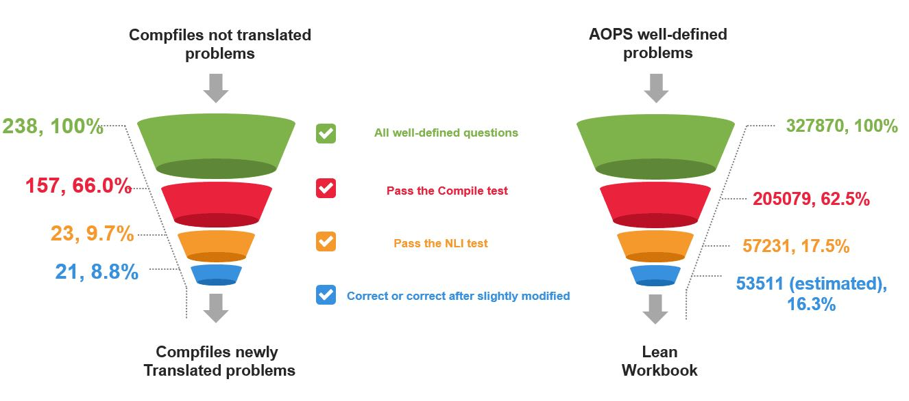

# Lean Workbook
We release Lean-Workbook with 57K math problems formalized in Lean 4 with 5K searched proof for autoformalization and auto theorem proving. [🤗Dataset](https://huggingface.co/datasets/internlm/Lean-Workbook) 



# Translate your natural language problem

```
torchrun --nproc-per-node=$NUMBER --master_port $PORT --rdzv-backend=c10d inference_translate_answer.py \
        --model-path "$MODEL_PATH" \
        --max-new-token 1000 \
        --temperature 0.01 \
        --repeat_times 1 \
        --question-file "$QUESTION_JSONL_FILE" \
        --answer-file "$OUTPUT_FILE_PATH"
```

Note that the python file will automatically create the output path. Your data jsonl file should use the same key as in our published datasets.

# Running backtranslate or NLI
```
torchrun --nproc-per-node=$NUMBER --master_port $PORT --rdzv-backend=c10d inference_backtranslate.py \
        --model-path "$MODEL_PATH" \
        --max-new-token 1000 \
        --temperature 0.01 \
        --repeat_times 1 \
        --question-file "$Translate_OUTPUT_FILE_PATH" \
        --answer-file "$BT_OUTPUT_FILE_PATH"

torchrun --nproc-per-node=$NUMBER --master_port $PORT --rdzv-backend=c10d inference_nli.py \
        --model-path "QWEN_MODEL_PATH" \
        --max-new-token 1000 \
        --temperature 0.01 \
        --repeat_times 1 \
        --question-file "$BT_OUTPUT_FILE_PATH" \
        --answer-file "$NLI_OUTPUT_FILE_PATH"
```
If the NLI output contains same, then it passes the NLI test.

# Citation
```
@misc{ying2024lean,
      title={Lean Workbook: A large-scale Lean problem set formalized from natural language math problems}, 
      author={Huaiyuan Ying and Zijian Wu and Yihan Geng and Jiayu Wang and Dahua Lin and Kai Chen},
      year={2024},
      eprint={2406.03847},
      archivePrefix={arXiv},
      primaryClass={cs.CL}
}
```
